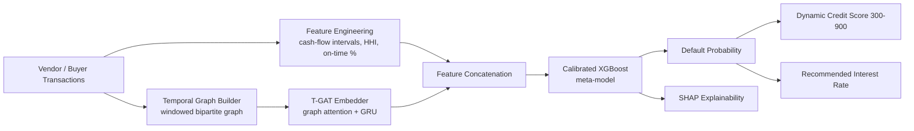
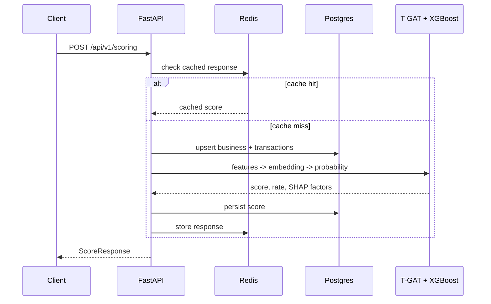

# Algorithmic Credit Risk & Working Capital Scoring Engine

A hybrid **T-GAT + XGBoost** stacked ensemble that scores MSME / gig-economy
creditworthiness from alternative transactional data (vendor payment
histories, invoice timelines, cash-flow intervals) instead of traditional
bureau history, and serves it as a production-shaped FastAPI service.

## Problem statement

Banks and fintech lenders under-serve MSMEs and gig-economy workers because
standard credit bureaus have thin or no history on them. Lenders either skip
these borrowers (missed loan growth) or price risk poorly using static rules
(elevated NPAs). This project treats the *shape of a business's cash-flow
graph over time* as the primary risk signal.

## Architecture





## AI/ML methodology

1. **Feature engineering** (`features/engineering.py`) — cash-flow interval
   statistics, vendor/buyer HHI concentration, on-time settlement rate,
   revenue-to-transaction-volume consistency.
2. **Temporal graph construction** (`features/graph_builder.py`) — each
   business becomes a fixed-size, time-windowed bipartite graph over its top
   counterparties, with edge features for normalized amount, recency, and
   on-time behavior.
3. **T-GAT embedder** (`models/tgat.py`) — a dependency-light, pure-PyTorch
   temporal graph attention network: additive attention pools each time
   window's counterparty graph, and a GRU rolls the per-window embeddings
   through time. Pretrained with an auxiliary default-prediction head.
4. **Stacked XGBoost meta-model** (`models/xgboost_scorer.py`) — consumes
   tabular features concatenated with the frozen T-GAT embedding, with
   isotonic probability calibration so downstream interest-rate pricing is
   trustworthy, not just rank-ordered.
5. **Evaluation** (`training/evaluate.py`) — AUC-ROC, AUC-PR, Brier score,
   max-F1; a CI-enforced model-quality gate (`tests/evaluation/`) fails the
   build if the pipeline stops learning real signal.
6. **Explainability** (`explainability/shap_explainer.py`) — SHAP
   TreeExplainer surfaces the top features behind each individual scoring
   decision, returned directly in the API response.
7. **Experiment tracking** — every training run logs params/metrics/artifacts
   to MLflow (`mlruns/`, file-backed by default).

### On the data

No public dataset pairs granular MSME vendor-transaction graphs with default
labels for redistribution. `data/synthetic_generator.py` implements a fully
documented generative process (payment jitter scaling with a latent risk
factor, vendor concentration, an autocorrelated "distress spiral") so the
model has genuine, learnable structure. This is disclosed explicitly rather
than presented as real data — swapping in a real transaction feed only
requires conforming to the `Transaction` / `BusinessProfile` schemas in
`data/schemas.py`.

## Technology stack

| Layer | Choice | Why |
|---|---|---|
| API | FastAPI + Pydantic v2 | async, typed, auto-generated OpenAPI docs |
| Graph/DL | PyTorch (custom T-GAT, no PyG) | avoids CUDA/PyG wheel fragility for reproducibility |
| Tabular model | XGBoost + isotonic calibration | strong tabular baseline, well-calibrated probabilities |
| Explainability | SHAP | per-decision feature attribution for a regulated domain |
| DB | PostgreSQL + SQLAlchemy 2.0 + Alembic | relational integrity, versioned schema |
| Cache | Redis | dedupe repeated scoring requests |
| Experiment tracking | MLflow | reproducible run history |
| CI/CD | GitHub Actions | lint, typecheck, test, docker build on every push |
| Packaging | Docker multi-stage | small, non-root production image |

## Project structure

```text
src/credit_risk/
├── config.py            # pydantic-settings configuration
├── data/                 # schemas + synthetic data generator
├── features/              # tabular feature engineering + graph builder
├── models/                 # T-GAT, XGBoost scorer, ensemble
├── training/                # training pipeline + evaluation metrics
├── explainability/            # SHAP explainer
├── db/                          # SQLAlchemy models, session, repository
└── api/                          # FastAPI app, routers, services
```

## Setup

### Local (no Docker)

```bash
python -m venv .venv && source .venv/bin/activate
pip install -e ".[dev]"
cp .env.example .env

# start postgres + redis however you prefer, e.g.:
docker compose up -d db redis

alembic upgrade head
python scripts/train.py        # trains T-GAT + XGBoost on synthetic data, writes artifacts/
uvicorn credit_risk.api.main:app --reload
```

### Docker

```bash
cp .env.example .env
python scripts/train.py         # produces ./artifacts, mounted read-only into the api container
docker compose up --build
```

API docs: `http://localhost:8000/docs`

## Environment variables

See `.env.example` — covers database/redis URLs, model artifact locations,
MLflow tracking URI, cache TTL, and synthetic-data generation size.

## API usage

```bash
curl -X POST http://localhost:8000/api/v1/scoring \
  -H "Content-Type: application/json" \
  -d '{
        "business_profile": {
          "business_id": "biz_00042",
          "sector": "retail",
          "months_active": 18,
          "declared_monthly_revenue": 42000,
          "n_active_vendors": 4,
          "n_active_buyers": 6
        },
        "transactions": [ ... ]
      }'
```

Response:

```json
{
  "business_id": "biz_00042",
  "default_probability": 0.1832,
  "credit_score": 790,
  "recommended_interest_rate_pct": 12.03,
  "top_contributing_factors": [
    {"feature": "pct_settled_on_time", "shap_value": -0.42},
    {"feature": "vendor_concentration_hhi", "shap_value": 0.18}
  ],
  "cached": false
}
```

## Testing

```bash
make test
```

- `tests/unit` — feature engineering, graph construction, XGBoost wrapper
- `tests/integration` — full API flow against a freshly trained tiny model, with a fake Redis backend
- `tests/evaluation` — CI-enforced minimum AUC-ROC / Brier score gate on a held-out split

## Evaluation methodology

Train/test split is stratified on the default label and held constant across
both the T-GAT pretraining phase and the XGBoost fit, so no test-set leakage
occurs between stages. Metrics reported: AUC-ROC and AUC-PR (discrimination),
Brier score (calibration), and max-F1 (an operating-point summary). Metrics
are logged to MLflow on every run for longitudinal comparison.

## Limitations

- Training data is synthetic; absolute metric values are not claims about
  real-world MSME default prediction performance — only about whether the
  architecture correctly learns injected signal.
- T-GAT is a custom, simplified attention mechanism, not a literal
  reproduction of any single published T-GAT paper's architecture.
- No authentication/authorization layer — out of scope for a portfolio
  demonstration, but noted as a hard requirement before any real deployment.
- Interest-rate mapping is a simple linear function of default probability
  for demonstration; a production system would calibrate this against actual
  portfolio loss data and regulatory pricing constraints.

## Future improvements

- Replace the linear pricing function with a proper loss-given-default and
  expected-loss based pricing model.
- Add drift monitoring (feature and prediction distribution) and automated
  retraining triggers.
- Add authentication (OAuth2/JWT) and role-based access for loan officers.
- Extend the graph to a true multi-hop business-business network (shared
  counterparties) rather than per-business bipartite subgraphs.