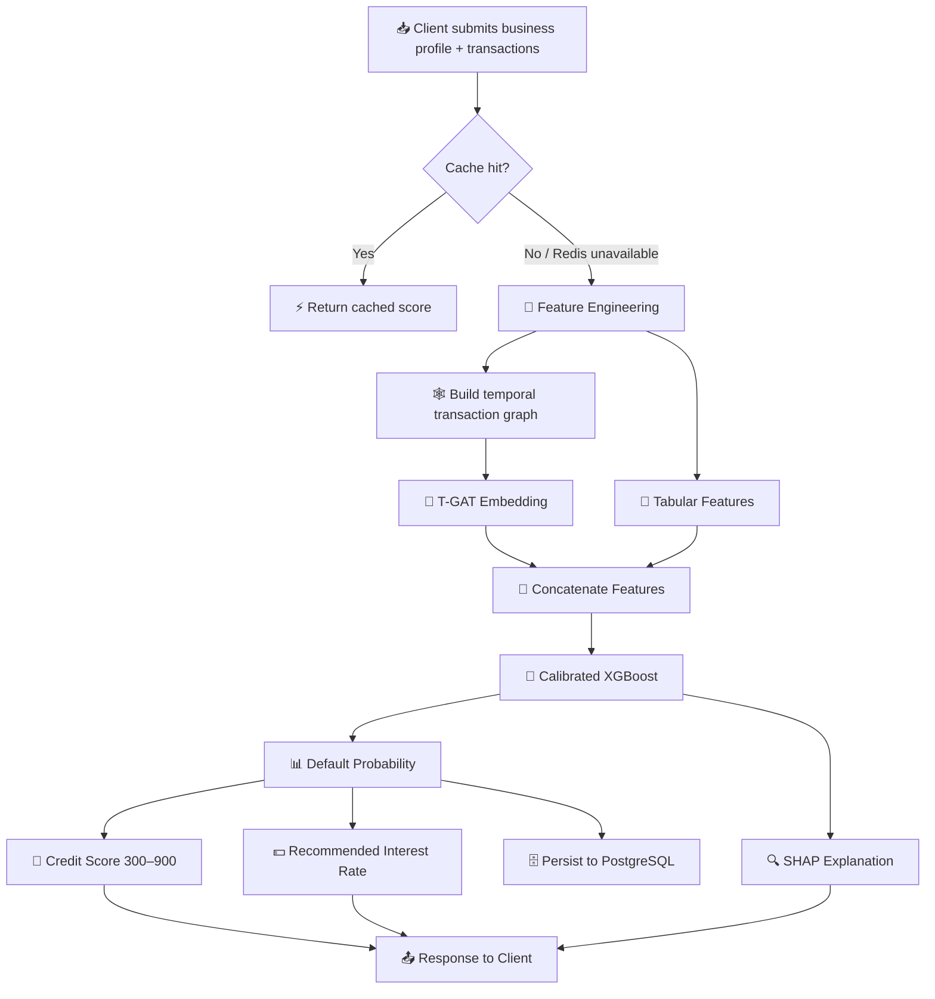
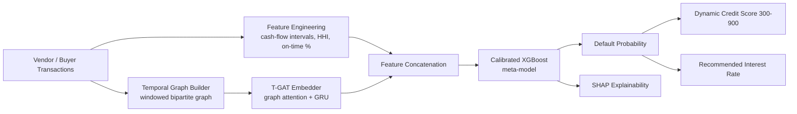
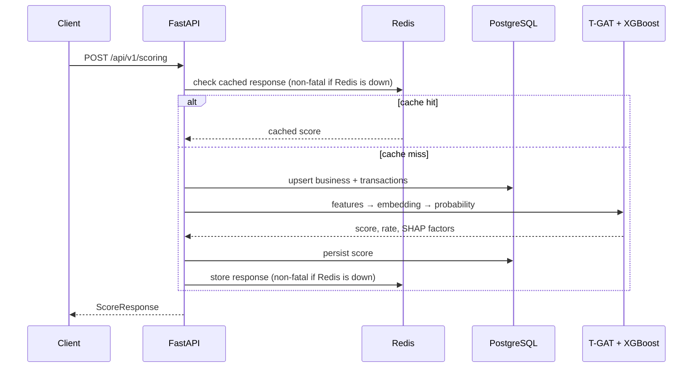

# 💳 Algorithmic Credit Risk & Working Capital Scoring Engine

### A hybrid Graph Attention Network + Gradient Boosting system for scoring MSME & gig-economy creditworthiness from alternative transactional data

<!--
  PLACEHOLDER — hero banner image
  Suggested: an abstract graph/network visual over a financial dashboard theme.
  Save as: docs/images/hero-banner.png  (recommended size: 1600x400)
-->

---

## 📑 Table of Contents

- [Overview](#-overview)
- [Problem Statement](#-problem-statement)
- [Motivation](#-motivation)
- [Key Features](#-key-features)
- [System Workflow](#-system-workflow)
- [Architecture](#-architecture)
- [Tech Stack](#-tech-stack)
- [Project Structure](#-project-structure)
- [Setup & Installation](#-setup--installation)
- [Environment Variables](#-environment-variables)
- [API Usage & Examples](#-api-usage--examples)
- [Results & Screenshots](#-results--screenshots)
- [Evaluation Methodology](#-evaluation-methodology)
- [Engineering Notes](#-engineering-notes-real-bugs-found--fixed)
- [Testing](#-testing)
- [Docker](#-docker)
- [CI/CD](#-cicd)
- [Limitations](#-limitations)
- [Future Improvements](#-future-improvements)
- [License](#license)

---

## 🔎 Overview

This project is a **production-shaped machine learning system** that scores the
creditworthiness of small businesses and gig-economy workers using **alternative
transactional data** — vendor payment histories, invoice timelines, and cash-flow
patterns — instead of traditional credit bureau history.

At its core is a **stacked ensemble**: a custom **Temporal Graph Attention Network
(T-GAT)** learns a dense representation of each business's transaction graph over
time, which is concatenated with hand-engineered financial features and fed into a
**calibrated XGBoost meta-model**. The result is a dynamic credit score, a
recommended interest rate, and a per-decision explanation — all served through a
typed, tested, containerized **FastAPI** service.

It's built to demonstrate the full lifecycle of an applied ML system: data
generation, feature engineering, graph representation learning, model stacking,
calibration, explainability, a real relational schema, a caching layer, automated
testing, CI/CD, and Docker packaging — not just a notebook with a `.predict()` call.

## 💡 Problem Statement

Banks and fintech lenders systematically under-serve **Micro, Small, and Medium
Enterprises (MSMEs)** and **gig-economy workers**, because traditional credit
bureaus have thin or no history on them. This forces lenders into one of two bad
outcomes:

- **Reject the applicant outright** → missed loan growth, financial exclusion.
- **Price risk using static, rule-based heuristics** → elevated Non-Performing
  Assets (NPAs) from mis-priced risk.

The transactional data *does* exist, though — payment timing, vendor
relationships, and cash-flow rhythm are rich, underused signals of financial
health. This project treats the **shape of a business's cash-flow graph over
time** as the primary risk signal, rather than a static credit history snapshot.

## 🎯 Motivation

> *"In corporate and SME banking, evaluating creditworthiness is bottlenecked by a
> lack of credit history. A hybrid ML pipeline using alternative transaction flow
> data can reduce false-positive default predictions and enable safer, automated
> working capital lending."*

This project was built to demonstrate applied competence across the full modern
AI/ML engineering stack: graph representation learning, model stacking and
calibration, explainability, production API design, database schema design,
caching resilience, automated testing, and containerized deployment — the kind of
end-to-end ownership expected of an AI/ML/GenAI engineer, not just model-fitting
in a notebook.

## ✨ Key Features

- 🕸️ **Custom Temporal Graph Attention Network (T-GAT)** — dependency-light, pure
  PyTorch implementation (no PyTorch Geometric) for maximum reproducibility.
- 🌲 **Stacked XGBoost meta-model** with isotonic probability calibration for
  trustworthy, well-calibrated default probabilities.
- 🔍 **Per-decision explainability** via SHAP — every score ships with the top
  contributing features.
- 📊 **Synthetic data generation** with a fully documented, interpretable
  generative process (payment jitter, vendor concentration, autocorrelated
  distress spirals) — disclosed transparently rather than hidden.
- ⚡ **Production-shaped FastAPI service** — typed schemas, dependency injection,
  structured logging, auto-generated OpenAPI docs.
- 🗄️ **Relational persistence** with PostgreSQL, SQLAlchemy 2.0, and
  Alembic-versioned migrations.
- 🚦 **Resilient caching** — Redis speeds up repeated requests, but a Redis outage
  degrades gracefully instead of failing scoring requests.
- 📈 **Experiment tracking** with MLflow (SQLite-backed, zero extra services).
- 🧪 **Real automated test suite** — unit, integration, and CI-enforced model
  quality gates (not vanity tests).
- 🐳 **Multi-stage Docker build** and **GitHub Actions CI/CD** pipeline.

## 🔄 System Workflow

## 🏗️ Architecture

<!--
  PLACEHOLDER — architecture illustration
  Suggested: a clean layered-diagram infographic (data → graph model → ensemble → API).
  Save as: docs/images/architecture-illustration.png
-->

### Request lifecycle

### Why a stacked ensemble, not a single model?

| Component | Role |
|---|---|
| **T-GAT** | Learns *relational + temporal* structure — who a business transacts with, how consistently, and how that evolves over time. |
| **Tabular features** | Captures interpretable, auditable signals (concentration ratios, on-time %) that a regulator or credit committee can sanity-check directly. |
| **XGBoost meta-model** | Combines both into a single, calibrated, well-understood tabular model — strong performance without sacrificing explainability. |

